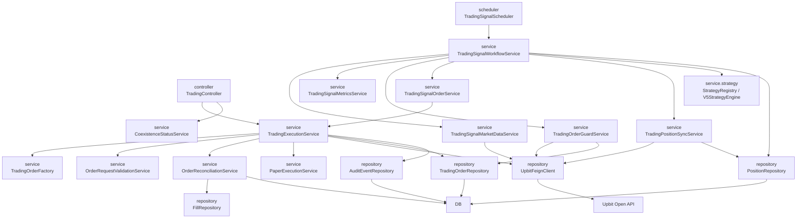
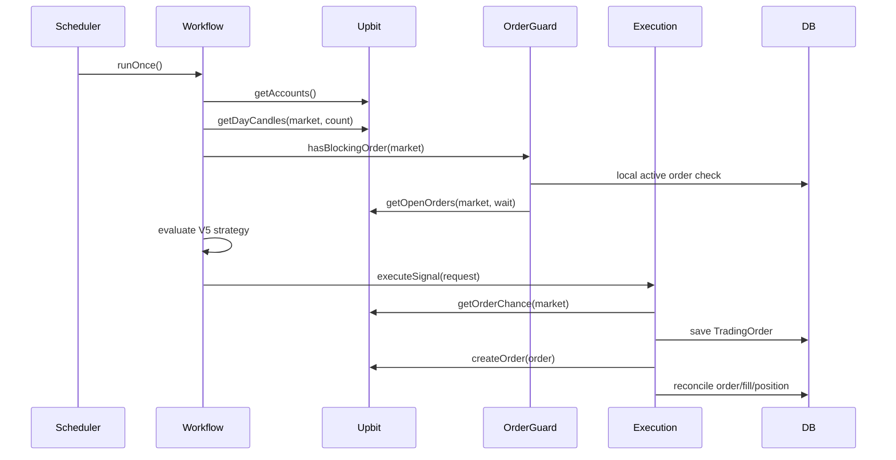
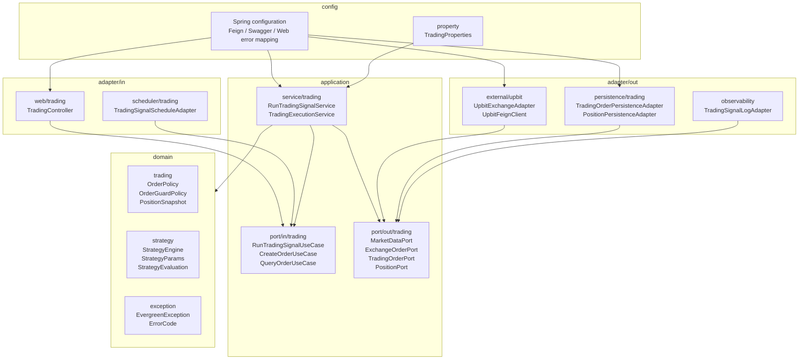

# 아키텍처 구조도

검토일: 2026-06-23

## 1. 가져온 기준

이 문서는 포트/어댑터 기반 클린 아키텍처 기준을 Evergreen에 맞게 정리한 것이다.

목표 기준은 다음 네 루트 패키지를 중심으로 한다.

```text
adapter
application
config
domain
```

의존성 방향은 다음과 같다.

```text
adapter -> application -> domain
config  -> adapter/application/domain
```

Evergreen의 현재 구현은 아직 이 구조가 아니다. 현재는 Spring MVC와 JPA 중심의 `controller/service/repository/data/config` 구조다. 따라서 이 문서는 현재 구조도와 목표 구조도를 분리한다.

## 2. 현재 Evergreen 구조도



현재 구조의 특징:

- `service`가 유스케이스 조합, 도메인 규칙, 트랜잭션, 외부 API 호출 조립을 함께 담당한다.
- `repository.UpbitFeignClient`는 이름은 repository지만 실제 역할은 외부 API client다.
- `data.dto`에는 내부 API DTO와 Upbit 원본 request/response 타입이 함께 있다.
- `data.entity`와 Spring Data repository가 서비스에서 직접 사용된다.
- 전략 코어는 `service.strategy.core`에 있어 비교적 순수한 규칙 계층에 가깝다.

## 3. 현재 LIVE 모드 런타임 흐름

아래 흐름은 스케줄러가 LIVE 모드에서 자동 주문까지 진행하는 경우다. PAPER 모드는 Upbit 계좌 동기화, 외부 미체결 주문 조회, 주문 가능 정보 조회, 주문 생성 호출을 건너뛴다.



## 4. 목표 클린 아키텍처 구조도

아래 화살표는 소스 코드 의존성 방향이다. 런타임 호출은 application service가 outbound port 인터페이스를 호출하고, Spring DI가 해당 port 구현체인 outbound adapter를 연결한다.



목표 구조의 핵심은 다음과 같다.

- Web controller와 scheduler는 application inbound port만 호출한다.
- Application service는 유스케이스 흐름과 트랜잭션을 담당한다.
- 순수 주문 정책, 포지션 정책, 전략 계산은 domain으로 내린다.
- Upbit Feign, JPA repository, 로그 출력은 outbound adapter가 감싼다.
- Application은 Feign client, Spring Data repository, JPA entity를 직접 알지 않는다.

## 5. 패키지 매핑

| 현재 패키지 | 목표 패키지 | 판단 |
| --- | --- | --- |
| `controller` | `adapter/in/web/trading` | HTTP request/response 변환만 담당 |
| `scheduler` | `adapter/in/scheduler/trading` | 스케줄 trigger adapter |
| `service.TradingSignalWorkflowService` | `application/service/trading` | `RunTradingSignalUseCase` 구현체 |
| `service.TradingExecutionService` | `application/service/order` | `CreateOrderUseCase`, `CancelOrderUseCase`, `QueryOrderUseCase` 구현체 |
| `service.TradingOrderGuardService` | `application/service/order` + `domain/trading` | 조회 조합은 application, 판정 규칙은 domain |
| `service.strategy.core` | `domain/strategy` | Spring/JPA 의존 없는 전략 규칙으로 이동 가능 |
| `service.strategy.v5` | `domain/strategy/v5` | 전략 구현체 |
| `repository.UpbitFeignClient` | `adapter/out/external/upbit/client` | Upbit 원본 API client |
| `data.dto.Upbit*` | `adapter/out/external/upbit/request` / `response` | provider 원본 request/response |
| `data.dto.CreateOrderRequest` | `adapter/in/web/trading/request` | Web 입력 DTO |
| `data.dto.OrderDto` | `adapter/in/web/trading/response` | Web 응답 DTO |
| `data.entity` | `adapter/out/persistence/trading/entity` | JPA 모델 |
| `repository.*Repository` | `adapter/out/persistence/{subject}/repository` | Spring Data repository |
| `data.type` | `domain/type` 또는 feature domain | 비즈니스 enum은 domain으로 이동 |
| `data.exception` | `domain/exception` | HTTP status는 config/web에서 분리 |
| `config.TradingExceptionHandler` | `config/web` | HTTP error mapping |
| `data.property.TradingProperties` | `config/property` | 운영 설정 |

## 6. 전환 순서

대규모 리팩터링을 한 번에 하지 않는다. 신규 기능과 변경이 닿는 경계부터 이동한다.

1. `domain/strategy`를 먼저 분리한다.
   - 현재 `service.strategy.core`는 외부 기술 의존이 적어 이동 비용이 낮다.
2. Upbit outbound port를 만든다.
   - `ExchangeOrderPort`, `MarketDataPort`, `AccountPort`를 application에 두고 Upbit adapter가 구현한다.
3. Persistence outbound port를 만든다.
   - 주문/포지션/체결 repository 접근을 persistence adapter 뒤로 숨긴다.
4. Web request/response와 Upbit request/response를 분리한다.
   - 현재 `data.dto` 혼재를 해소한다.
5. 예외 모델을 분리한다.
   - domain error code와 HTTP status mapping을 분리한다.
6. ArchUnit 테스트를 추가한다.
   - 전환 이후 역방향 의존 회귀를 막는다.

## 7. 아키텍처 테스트 목표

전환 이후에는 다음 규칙을 테스트로 강제한다.

- 루트 패키지는 `adapter`, `application`, `config`, `domain`만 허용한다.
- `domain`은 Spring, JPA, Feign, Servlet에 의존하지 않는다.
- `application`은 `adapter`에 의존하지 않는다.
- `adapter/in`은 `adapter/out`에 직접 의존하지 않는다.
- Web controller는 application service 구현체가 아니라 inbound use case를 주입한다.
- Application service는 Spring Data repository와 Feign client를 직접 주입하지 않는다.
- JPA entity는 persistence adapter 밖으로 노출하지 않는다.
- 외부 API 원본 request/response는 Upbit adapter 밖으로 노출하지 않는다.

## 8. 현재 작업 범위

이번 문서는 구조도와 전환 기준을 가져오는 작업이다. 실제 패키지 이동은 하지 않았다.

이유:

- 현재 PRD/spec 및 Upbit API 정합성 수정이 이미 열린 변경에 포함되어 있다.
- 패키지 이동은 영향 범위가 크고 테스트/커밋 단위를 별도로 잡아야 한다.
- 현재 운영 리스크는 구조 전환보다 LIVE 주문 상한, rate limit, error decoder가 더 직접적이다.
