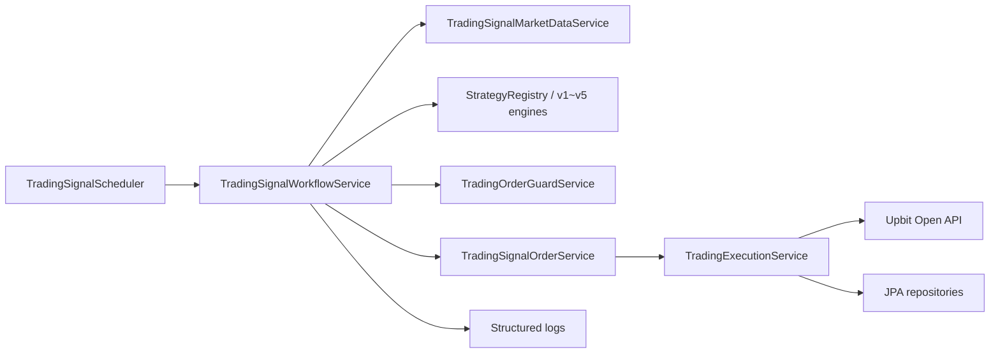

# Evergreen Technical Specification

검토일: 2026-06-23

## 1. 시스템 경계

Evergreen은 단일 Spring Boot 애플리케이션으로 동작한다. 외부 의존성은 Upbit Open API, 운영 DB, Config Server, 로그 수집/대시보드 시스템이다.

현재 패키지 구조와 클린 아키텍처 목표 구조는 [아키텍처 구조도](architecture.md)에 분리해 정리한다.

## 2. 주요 모듈

| 모듈 | 역할 |
| --- | --- |
| `scheduler` | 설정된 fixed delay로 전략 실행을 트리거한다. |
| `controller` | 수동 잔고/주문/취소/시그널/공존상태 API를 제공한다. |
| `repository.UpbitFeignClient` | Upbit REST API endpoint를 선언한다. |
| `service.auth` | Upbit JWT와 query_hash를 생성하고 Feign 요청에 인증 헤더를 붙인다. |
| `service.TradingSignalWorkflowService` | 마켓별 신호 평가와 주문 제출의 상위 workflow를 담당한다. |
| `service.TradingExecutionService` | 주문 검증, PAPER/LIVE 실행, Upbit 주문 요청/조회/취소를 담당한다. |
| `service.TradingOrderGuardService` | 로컬 활성 주문과 거래소 미체결 주문 기반 차단 결정을 수행한다. |
| `service.TradingPositionSyncService` | LIVE 모드 계좌 잔고를 포지션 상태로 동기화한다. |
| `service.strategy` | 전략 파라미터 해석과 v1~v5 전략 평가를 담당한다. |
| `data.entity` | 주문, 체결, 포지션, drift snapshot, 감사 이벤트를 저장한다. |

## 3. Upbit API 계약

한국 Upbit Open API 기준 endpoint는 `https://api.upbit.com/v1`이다.

| 기능 | 공식 endpoint | 구현 |
| --- | --- | --- |
| 잔고 조회 | `GET /accounts` | `getAccounts()` |
| 주문 가능 정보 | `GET /orders/chance?market=` | `getOrderChance(market)` |
| 현재가 조회 | `GET /ticker?markets=` | `getTickers(markets)` |
| 일 캔들 조회 | `GET /candles/days?market=&count=` | `getDayCandles(market, count)` |
| 주문 생성 | `POST /orders` | `createOrder(request)` |
| 개별 주문 조회 | `GET /order?uuid=` | `getOrder(uuid)` |
| 개별 주문 취소 | `DELETE /order?uuid=` | `cancelOrder(uuid)` |
| 체결 대기 주문 조회 | `GET /orders/open?market=&state=` | `getOpenOrders(market, state)` |

공식 문서:
- https://docs.upbit.com/kr/reference/rest-api-guide
- https://docs.upbit.com/kr/reference/auth
- https://docs.upbit.com/kr/reference/get-balance
- https://docs.upbit.com/kr/reference/available-order-information
- https://docs.upbit.com/kr/reference/new-order
- https://docs.upbit.com/kr/reference/list-open-orders
- https://docs.upbit.com/kr/reference/get-order
- https://docs.upbit.com/kr/reference/cancel-order
- https://docs.upbit.com/kr/reference/list-candles-days
- https://docs.upbit.com/kr/reference/list-tickers

## 4. 인증 설계

Upbit Exchange API 요청은 JWT Bearer 인증을 사용한다.

토큰 payload:
- `access_key`: API access key.
- `nonce`: 매 요청마다 새로운 UUID.
- `query_hash`: 요청 query string 또는 JSON body를 query string 형태로 변환한 SHA-512 해시.
- `query_hash_alg`: `SHA512`.

구현 기준:
- query/body가 없으면 `query_hash`를 넣지 않는다.
- query/body가 있으면 실제 요청 필드 순서를 보존해 `key=value&key2=value2` 문자열을 만든다.
- 배열 query는 동일 key 반복 형태를 사용한다.
- 주문 생성 요청 DTO는 null 필드를 JSON body에서 제외해 market buy의 `volume`, market sell의 `price`가 불필요하게 전송되지 않도록 한다.

## 5. 주문 생성 매핑

| 도메인 주문 | Upbit side | Upbit ord_type | volume | price |
| --- | --- | --- | --- | --- |
| `BUY + LIMIT` | `bid` | `limit` | 주문 수량 | 지정가 |
| `SELL + LIMIT` | `ask` | `limit` | 주문 수량 | 지정가 |
| `BUY + MARKET_BUY` | `bid` | `price` | 생략 | 주문 총액 |
| `SELL + MARKET_SELL` | `ask` | `market` | 매도 수량 | 생략 |

`clientOrderId`는 Upbit `identifier`로 전달한다. Upbit 정책상 identifier는 계정 내에서 재사용할 수 없으므로 UUID 기반 생성은 적절하다.

## 6. 자동매매 실행 흐름

1. `TradingSignalScheduler`가 `evergreen.trading.interval`마다 실행된다.
2. `TradingSignalWorkflowService`가 설정된 마켓 목록을 정규화한다.
3. LIVE 모드이면 `TradingPositionSyncService`가 Upbit 잔고를 포지션으로 동기화한다.
4. 각 마켓별 일 캔들을 조회하고 닫힌 캔들 기준 signal index를 계산한다.
5. 로컬 활성 주문 또는 Upbit 미체결 주문이 있으면 해당 마켓 실행을 중단한다.
6. `signal-order-notional`과 신호 캔들 종가로 현재 포지션 비중을 계산한 뒤 활성 전략을 평가한다.
7. 매수/매도 신호와 포지션 상태를 로그로 남긴다.
8. 신호가 있으면 `TradingSignalOrderService`가 주문 요청을 생성한다.
9. `TradingExecutionService`가 주문을 검증하고 PAPER 또는 LIVE로 실행한다.
10. LIVE 주문 응답은 `OrderReconciliationService`가 주문/체결/포지션 상태로 반영한다.

## 7. 데이터 모델

| Entity | Key | 설명 |
| --- | --- | --- |
| `TradingOrder` | `clientOrderId` | 내부 주문과 Upbit 주문 UUID, 주문 상태, 요청/체결 금액을 저장한다. |
| `Fill` | composite key | 체결 시각과 trade uuid 기준으로 중복 체결 저장을 방지한다. |
| `TradingPosition` | `symbol` | 마켓별 총 수량, 평균가, 상태를 저장한다. |
| `PositionDriftSnapshot` | generated id | 거래소 총 수량과 내부 managed quantity 차이를 기록한다. |
| `AuditEvent` | `eventId` | 주문 실행/취소 같은 감사 이벤트를 저장한다. |

## 8. 설정

`evergreen.trading` prefix:

| 설정 | 기본값 | 설명 |
| --- | --- | --- |
| `base-url` | `https://api.upbit.com` | Upbit REST API base URL |
| `access-key` | 빈 값 | Upbit access key |
| `secret-key` | 빈 값 | Upbit secret key |
| `fee-rate` | `0.0005` | 주문 금액 산정용 수수료율 |
| `interval` | `30s` | 스케줄 실행 주기 |
| `execution-mode` | `LIVE` | `PAPER` 또는 `LIVE` |
| `markets` | `KRW-BTC` | 자동매매 대상 마켓 |
| `candle-count` | `400` | 일봉 조회 수 |
| `closed-candle-only` | `true` | 최신 미완성 캔들 제외 여부 |
| `signal-order-notional` | `100000` | 목표 비중 주문의 기준 금액. PAPER 주문 금액과 LIVE 자동 증액 상한 계산에 사용 |
| `active-strategy-version` | `v5` | 활성 전략 버전. `v1`~`v5` 중 선택 |

운영에서는 `execution-mode` 기본값이 `LIVE`인 점을 별도로 통제해야 한다. 배포 기본값은 Config Server 또는 환경변수에서 `PAPER`로 명시하는 것이 안전하다.

## 9. 관측성

주요 로그 이벤트:
- `event=position_sync`
- `event=position_snapshot`
- `event=external_position_drift`
- `event=external_order_guard`
- `event=candle_signal`
- `event=strategy_diagnostic`
- `event=trade_execution`

Grafana 대시보드 정의는 `docs/grafana_trading_dashboard.json`에 있다.

## 10. 검증 전략

- DTO 계약 테스트: Upbit 응답 필드 타입, 주문 요청 null 제외, JSON 역직렬화.
- 인증 테스트: JWT payload와 query_hash 생성.
- 서비스 테스트: 주문 검증, 가드, 포지션 동기화, 전략 workflow.
- 전체 회귀: `./gradlew test`.
- 배포 전 점검: Upbit 문서 변경, API Key 권한, 허용 IP, rate limit, PAPER 로그.

## 11. 현재 확인된 리스크

1. `targetPositionRatio`가 없는 fallback LIVE 매수는 요청 금액이 없으면 가용 KRW 전액을 사용한다. 운영 전략은 `targetPositionRatio`와 `signal-order-notional` 경로를 사용해야 한다.
2. Upbit rate limit group별 client-side limiter가 없다.
3. 429/5xx 응답에 대한 retry/backoff 정책이 명시되어 있지 않다.
4. Upbit `Test Order` API를 통한 LIVE 전 dry-run 검증이 없다.
5. DB migration 체계가 명시되어 있지 않아 운영 DB 변경 이력이 불명확할 수 있다.
6. `market.order_types`는 공식 문서상 deprecated 예정이므로, 필요한 경우 `bid_types`와 `ask_types` DTO를 추가해야 한다.
